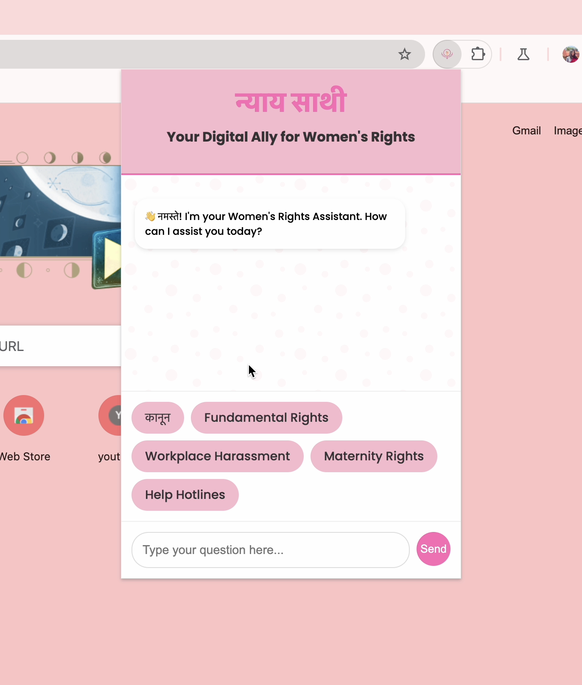

# Nyaya-Sathi 🤖💜

**Nyaya-Sathi** (Justice Companion) is a friendly AI-powered chatbot designed to help women and girls by providing easy access to information on their rights, safety, healthcare, and empowerment. This project is built with a goal to support gender equality and make valuable information available to those who need it.

---

## Why I Built This 💡
In many parts of the world, women and girls don’t always know their rights or have easy access to information that could protect them. Nyaya-Sathi was built to help change that. With this chatbot, women can ask questions about their rights and get quick answers, making it easier to understand and stand up for themselves.

## Features 
- **Smart Answers**: Uses AI to provide clear, helpful answers to questions about gender rights and safety.
- **Quick Suggestions**: Offers suggested questions to help users get started.
- **Language Options**: Includes local languages for broader reach.
- **Private Access**: No login needed to use the chatbot, ensuring privacy.

## Tech Stack 🛠️
- **Frontend**: HTML, CSS, JavaScript
- **Google Chrome's Built-In Prompt API:**

## Demo

 

Nyaya-Sathi demo [here](https://youtu.be/5RDBKImLISM)

## Future Improvements 🔮
1. More Languages: Add support for additional languages.
2. Expanded Knowledge: Continuously update with more information.
3. Voice Feature: Include a voice option to make it even easier to use.

